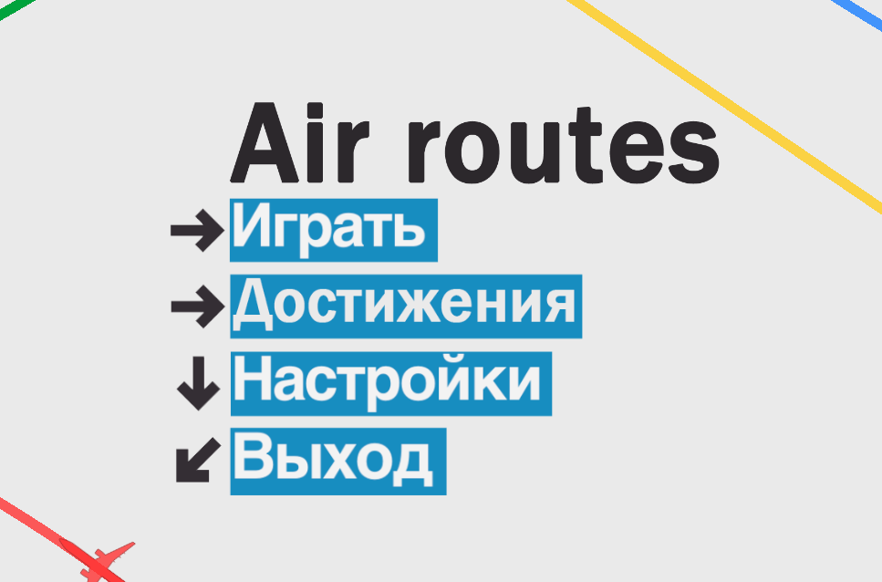
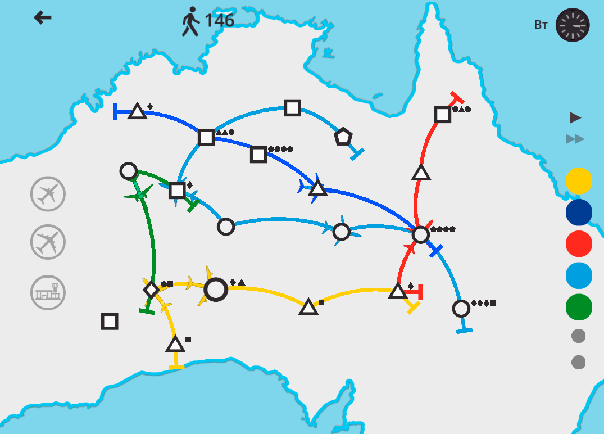

# Air Routes

> Компьютерная стратегическая игра-головоломка о построении эффективной сети авиалиний.  
> Разработана на Godot Engine под операционную систему Аврора в качестве учебного проекта.

---

## Скриншоты

---

### Об игре

Air Routes — это минималистичная стратегия, вдохновлённая играми вроде Mini Metro и Mini Motorways.
Игроку предстоит управлять растущей сетью авиалиний, соединяя аэропорты и распределяя пассажиропоток между маршрутами.

Каждый аэропорт обладает собственной формой, определяющей тип пассажиров, которых он может принимать.
Со временем нагрузка на транспортную сеть увеличивается, появляются новые аэропорты и возрастает количество пассажиров, что усложняет управление маршрутами.

Главная задача игрока — поддерживать стабильную и эффективную работу всей системы.
Самолёты! Мы их уже упоминали?

---

### Игровые механики

#### Аэропорты

Каждый аэропорт располагается в определённой точке карты и обозначается геометрической фигурой:

* ■ Квадрат
* ▲ Треугольник
* ★ Звезда
* и другие…

Тип фигуры определяет, каких пассажиров способен принимать аэропорт.

---

### Пассажиры

Со временем в аэропортах появляются пассажиры.
Они также изображаются геометрическими фигурами меньшего размера.

Форма пассажира показывает, в какой аэропорт он хочет попасть.

Пассажиры появляются случайным образом, создавая постоянный поток нагрузки на сеть.

---

### Авиалинии

Игрок может создавать маршруты между аэропортами, рисуя дуги на карте.

После создания маршрута по нему начинают курсировать самолёты:
* Посадка пассажиров
* Высадка пассажиров
* Перемещение между точками

---

### Управление самолетами

Игрок может:
* Перебрасывать самолёты между линиями
* Усиливать загруженные маршруты
* Добавлять новые самолёты
* Оптимизировать сеть под растущий пассажиропоток

---

### Принципы разработки

* **Один объект** — один основной скрипт
* Логика UI не смешивается с игровой логикой
* Все глобальные системы проходят через `GameData`

---

### Запуск проекта в Godot

Для запуска вам нужно скачать ветку `dev` в удобное место на вашем ПК. Во время запуска движка вам нужно выбрать эту папку с проектом и импортировать её.

Готово! Теперь вы запустили нашу игру в движке Godot.

---
### Как собирать

Этот файл предназначен для тех, кто собирает APK/AAB из этого репозитория. Не сохраняйте в репозитории реальные секретные данные или закрытые ключи.

1) Необходимый набор инструментов

Godot: откройте honor-of-aurora/project.godot в установленном Godot 4.x.
JDK и Android SDK: используйте версии, совместимые с вашей установкой Godot 4.x.
Шаблон экспорта Android для вашей версии Godot должен быть установлен локально.

2) Настройка бэкенда для сборки разработчика

Откройте backend/.
Скопируйте env.example в локальный файл env/переменные оболочки (например: .env).
Заполните локальные значения, если необходимо (никогда не сохраняйте их в репозитории).

Запуск бэкенда:
python -m venv .venv
Windows PowerShell: .\.venv\Scripts\Activate.ps1
pip install -r requirements.txt
alembic upgrade head
uvicorn main:app --reload --host 127.0.0.1 --port 8000

3) Конфигурация платежей клиента Godot

В сцене PayShopMenu установите экспортируемую переменную payment_api_base_url:
Локальный бэкенд разработчика: http://127.0.0.1:8000
Пустое значение означает резервный поток "мгновенной покупки" (без серверного API платежей).
Не прописывайте секреты провайдера в игровых скриптах/сценах.

4) Что необходимо предоставить внеполосным способом

Получайте это только через частный канал (не Git):

Артефакты подписи Android:
файл хранилища ключей релиза
псевдоним/пароли хранилища ключей
URL бэкенда для payment_api_base_url
Секреты веб-хука/провайдера релиза (STUB_WEBHOOK_SECRET или реальные секреты провайдера)
Любые идентификаторы продавцов, которые не являются общедоступными в соответствии с политикой провайдера

---

### Технологии

| Компонент | Детали |
| --- | --- |
| Движок | Godot 4.4 |
| Язык | GDScript |
| Рендеринг | GL Compatibility |
| Формат проекта | `honor-of-aurora/project.godot` |
| Экспорт | `honor-of-aurora/export_presets.cfg` |
| Платформы | Android APK, ОС «Аврора» RPM, запуск из Godot |
| Аудио | OGG и WAV; атрибуция источников указана в `honor-of-aurora/audio/LICENSE_SOURCES.txt` |
